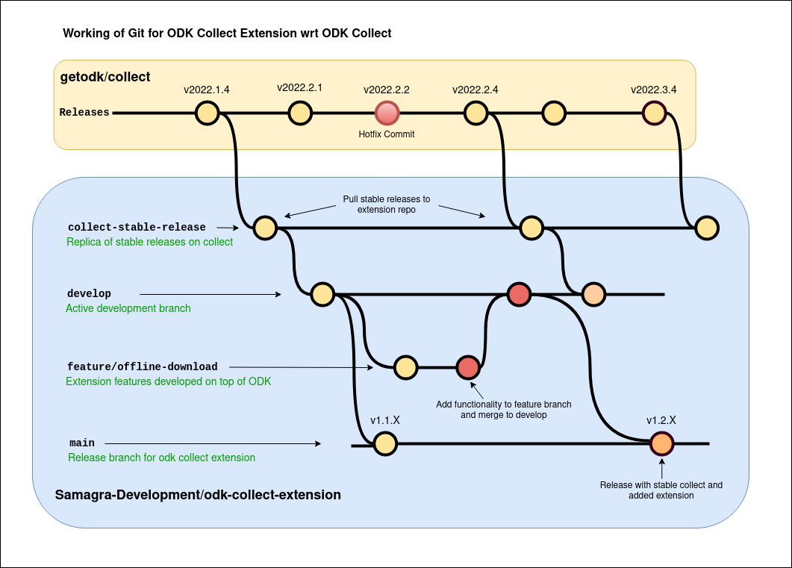

# ODK Extension Module

## Introduction

Open Data Kit (ODK) is an extremely powerful tool. We have been leveraging ODK to create forms and collect information in multiple mobile applications over the last few years. Our apps with ODK integrations have allowed thousands of teachers to undertake spot assessments of their students, helped regulators rate and monitor medical institute effectiveness & assist farmers secure a better income for their produce amongst other high social impact initiatives.

ODK is deeply embedded in our workflow at Samagra and we have invested heavily to modify it to meet our requirements. One of them is being able to integrate the ODK collect app inside our apps. The beauty of ODK has been to easily allow us to undertake the aforementioned mods. As we have greatly benefited from the ODK mods in the past and evangelized its adoption in the public domain, we find this is the right time to open-source the modified interactors we built on top of ODK Collect.

Introducing the ODK Extension Module - a set of interactors on top of ODK Collect that enables developers to seamlessly integrate ODK Collect into their own Android applications. With this module, developers can take advantage of all the powerful features of ODK Collect, while also customizing the app's functionality to meet their specific needs.
Designed to provide maximum flexibility and control, the ODK Interactor Module allows developers to embed ODK Collect within their existing applications, providing a seamless user experience for their users. They can also incorporate their own branding and design elements to maintain a consistent user experience across their entire suite of applications.
With the ODK Extension Module, developers can leverage these features to improve data quality, reduce errors, and streamline data collection workflows.
In addition to these powerful features, the ODK Interactor Module also provides developers with the ability to customize their response server, allowing them to store data on their own servers or in their own cloud storage, giving them more control over how data is managed and secured. The module also includes data prefill capabilities, allowing developers to pre-populate forms with data, reducing the need for manual data entry and minimizing errors.
In summary, the ODK Collect Integration Module is an essential tool for any organization looking to improve their mobile data collection activities. Whether you need to integrate data with other systems, enforce access control and security measures, manage workflows, or save on costs, the ODK Collect Integration Module has you covered.

## Need for ODK Extension Module

There could be several reasons why a module that enables users to embed the ODK Collect app inside their application could be beneficial. Here are some potential use cases:

1. *Customization*  
Embedding ODK Collect in their own application allows organizations to customize the app's user interface and functionality to better suit their specific needs. They can also incorporate their own branding and design elements to maintain a consistent user experience across their entire suite of applications.

2. *Integration with other systems*  
Organizations may need to integrate data collection with other systems or workflows, and embedding ODK Collect in their own application allows them to do this seamlessly. By embedding the app, data can be automatically transferred to other systems or databases, reducing the need for manual data entry and minimizing errors.

3. *User experience*  
Embedding ODK Collect in an existing application can improve the user experience, as users don't have to switch between different apps to collect and manage data. This can result in increased productivity and efficiency.

4. *Access control and security*  
Embedding ODK Collect in their own application allows organizations to enforce strict access controls and security measures to protect sensitive data. They can also store data on their own servers or in their own cloud storage, giving them more control over how data is managed and secured.

5. *Workflow management*  
By embedding ODK Collect in their own application, organizations can more easily manage and track data collection workflows. They can assign tasks to specific users or teams, monitor progress, and generate reports and analytics.

6. *Cost-effectiveness*  
Developing a custom application that includes the ODK Collect functionality can be more cost-effective than using the standalone Collect app, as it allows organizations to tailor the app to their specific needs without having to pay for features they don't require.

## Additional Features
1. *Integration of Zip to speed up the download process*  
This feature allows the module to download multiple forms as a single zip file from the server, which speeds up the download process compared to downloading each form individually.

2. *Parallel form download*  
This feature allows the module to download multiple forms in parallel, which speeds up the download process even more.

3. *Custom theming on form screens*  
This feature allows the module to customize the look and feel of the forms by providing a settings file that can be used to modify the form screens according to the user's needs.

4. *Callbacks on form submission*  
This feature allows the module to receive callbacks when a user submits a form, which can be used to perform custom actions based on the form submission.

5. *Configuration to submit results to a custom server*  
This feature allows the module to send form submission results to a custom server, which is useful when integrating with other systems.

6. *Form data prefilling*  
This feature allows the module to prefill form data based on user-provided values, which saves time and improves data accuracy.

7. *Automatic form download if a form is not available on device*  
This feature automatically downloads a form from the server if it is not already available on the local device before opening the form.

8. *Notification integration*  
This feature allows the module to modify ODK notifications based on the user's needs, such as changing the notification sound or adding custom text to the notification.

## Interfaces

**ODKInteractor**

The OdkInteractor interface is a key component of the ODK Interactor Module, which provides developers with methods for setting up, configuring, and resetting ODK, as well as opening a form. Using a JSON string, developers can configure ODK by pulling configuration information from a JSON file. The open form functionality not only ensures that the form exists on the device, but also checks for the required XML file and media files. If these files are not present on the device, the module will automatically download them from the server.
Refer to the technical documentation [here](./odk/extension/README.md#odkinteractor-interface).

**FormsDatabaseInteractor**

The FormsDatabaseInteractor interface provides a set of methods to interact with the local forms database. The interface includes methods for fetching a list of all locally available forms, getting a list of forms by formId, retrieving the latest version of a form by formId, and deleting forms from the database based on various criteria. Additionally, the interface provides methods for adding new forms to the database. By providing these functionalities, the FormsDatabaseInteractor interface helps to simplify the management of local forms on the device and make it easier for developers to incorporate forms functionality into their applications. Refer to the technical documentation [here](./odk/extension/README.md#formsdatabaseinteractor-interface).

**FormsNetworkInteractor**

The FormsNetworkInteractor interface provides a set of methods to interact with the server to download and manage forms. It is responsible for carrying out all network-related tasks, including checking for new forms available for download, downloading individual forms or a list of forms, checking if there is a new forms zip available for download, and downloading the latest version of a form based on its form ID. Developers can use this interface to manage forms on the server and ensure that their users have the latest version of the forms available. Refer to the technical documentation [here](./odk/extension/README.md#formsnetworkinteractor-interface).

**FormsInteractor**

The FormsInteractor interface provides methods for interacting with ODK forms. It allows users to open the latest version of a form based on its ID or MD5 hash, as well as prefill form values given specific tags and their corresponding values. The FormsInteractor interface is designed to provide an easy and convenient way to manage ODK forms and their data. Refer to the technical documentation [here](./odk/extension/README.md#formsinteractor-interface).

**FormInstanceInteractor**

FormInstanceInteractor is an interface that provides methods to interact with ODK Collect form instances. The interface provides methods to retrieve, delete, and open form instances, as well as retrieve instances by their path, status, and form ID. Refer to the technical documentation [here](./odk/extension/README.md#forminstanceinteractor-interface).

## Git Versioning

**The repository has the following branches:**

***collect-stable-release:*** This branch tracks the stable releases of the original getodk/collect repository. This branch is updated only when a new stable release is made available in the original repository. No active development is done in this branch.

***develop:*** This branch is used for active development. All feature branches are merged into this branch, and it is updated regularly. This branch is intended to be used for experimental and ongoing development work.

***feature/[FEATURE_NAME]:*** These branches are used for active development work, with each branch focusing on a specific feature or functionality. They are created from the develop branch, and when work is completed, they are merged back into develop.

***main:*** This branch is used to build releases derived from the develop branch. All completed work in the develop branch is merged 33into this branch for release. This branch is intended to be used for stable and production-ready releases.

## Contribution Guidelines

- Clone the repository and create a new branch from the develop branch for the `feature/bugfix` being worked on. Name the branch according to the feature being worked on.

- Make changes to the code in the branch and commit the changes regularly.

- Once the work is completed and tested, push the branch to the remote repository and create a Pull Request against the `develop` branch.

- The Pull Request will be reviewed by other contributors and merged into the `develop` branch if it meets the necessary requirements and passes any relevant testing.

- After a release candidate has been thoroughly tested, and deemed ready for release, the changes will be merged from `develop` to `main`, and a new release will be built and made available.
